# StreamingApp — Container Orchestration & Scaling on AWS EKS


## Project Overview

This project demonstrates the deployment of a containerized MERN-based Streaming Application using modern DevOps and container orchestration practices.

The application consists of multiple backend microservices, a React frontend, and MongoDB.

The implementation covers:

- Application containerization using Docker
- Local application validation using Docker Compose
- Amazon Elastic Container Registry (ECR)
- Jenkins CI/CD
- Amazon Elastic Kubernetes Service (EKS)
- Kubernetes Deployments and Services
- Kubernetes ConfigMaps and Secrets
- Health checks and probes
- Helm-based deployment
- Kubernetes scaling
- Rolling updates
- AWS Application Load Balancer
- Kubernetes Ingress
- Application verification
- CloudWatch monitoring and metrics
- Monitoring and logging
- SNS-based ChatOps notifications (bonus)
- Cost-conscious AWS deployment

---

# Architecture

```text
                         Developer
                             |
                             v
                      GitHub Repository
                             |
                             v
                          Jenkins
                         CI / CD
                             |
                             v
                    Amazon ECR (ap-south-1)
                             |
       +---------------------+---------------------+
       |          |          |          |          |
       v          v          v          v          v
     Auth     Streaming     Admin      Chat      Frontend
   Service     Service     Service    Service     Image
   :3001       :3002       :3003      :3004      nginx:80
       |          |          |          |          |
       +----------+----------+----------+----------+
                             |
                             v
                    Amazon EKS Cluster
                    streamingapp namespace
                             |
              +--------------+--------------+
              |                             |
              v                             v
        Kubernetes Services              MongoDB
              |                          :27017
              |
              v
        AWS Load Balancer
              |
              v
           Internet
```

---

# Application Services

| Service | Port | Purpose |
|---|---:|---|
| Auth Service | 3001 | Authentication and user management |
| Streaming Service | 3002 | Streaming functionality |
| Admin Service | 3003 | Administration APIs |
| Chat Service | 3004 | Chat and Socket.IO |
| Frontend | 3000 / 80 | React application |
| MongoDB | 27017 | Application database |

---

# AWS Region

All AWS resources used in this project are deployed in:

```text
ap-south-1
```

**AWS Region:** Mumbai, India

---

# PART 1 — Project Preparation

## Step 1 — Verify Git

```powershell
git --version
```

Expected:

```text
git version <version>
```
---

## Step 2 — Verify Docker

```powershell
docker --version
```
---

## Step 3 — Verify Docker Compose

```powershell
docker compose version
```
---

## Step 4 — Verify AWS CLI

```powershell
aws --version
```
---

## Step 5 — Verify AWS Identity

```powershell
aws sts get-caller-identity
```
---

# PART 2 — Clone the Application

## Step 6 — Create Project Directory

```powershell
C:
cd \
mkdir Projects
cd Projects
```
---

## Step 7 — Clone Repository

```powershell
git clone https://github.com/vinjithkannan/orchestration-assignment.git
```
---

## Step 8 — Enter Project Directory

```powershell
cd StreamingApp
```

---

## Step 9 — Check Git Status

```powershell
git status
```
---

## Step 10 — Development Branch

Verify:

```powershell
git branch
```

### Screenshot

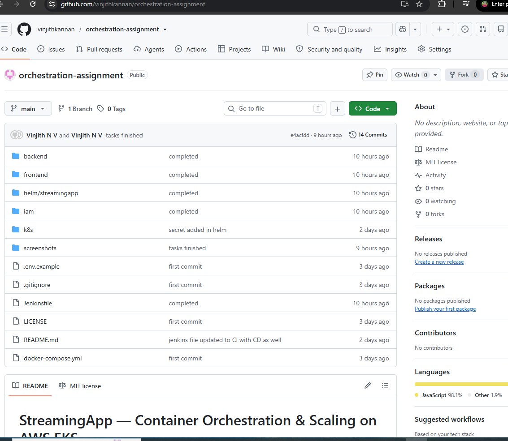

---

# PART 3 — Application Configuration

## Step 11 — Inspect Project Structure

Expected major structure:

```text
StreamingApp/
├── backend/
│   ├── authService/
│   ├── streamingService/
│   ├── adminService/
│   └── chatService/
├── frontend/
├── docker-compose.yml
├── .env.example
├── .gitignore
└── README.md
```
---

## Step 12 — Create Environment File

```powershell
Copy-Item .env.example .env
```

---

## Step 13 — Validate Docker Compose Configuration

```powershell
docker compose config
```

The configuration should be parsed successfully without YAML errors.

---

# PART 4 — Local Docker Deployment

## Step 14 — Start Application

```powershell
docker compose up --build
```

This builds and starts:

- MongoDB
- Auth Service
- Streaming Service
- Admin Service
- Chat Service
- Frontend

---

## Step 15 — Open Second Terminal

Open another PowerShell window and execute:

```powershell
cd C:\Projects\StreamingApp
```

---

## Step 16 — Check Compose Services

```powershell
docker compose ps
```
---

## Step 17 — Check Running Containers

```powershell
docker ps
```
---

## Step 18 — Test Auth Service

```powershell
curl http://localhost:3001/health
```

Expected response should indicate that the service is healthy.

---

## Step 19 — Test Streaming Service

```powershell
curl http://localhost:3002/api/health
```

---

## Step 20 — Test Chat Service

```powershell
curl http://localhost:3004/api/health
```
---

## Step 21 — Open Frontend

Open:

```text
http://localhost:3000
```
---

## Step 22 — Check Application Logs

```powershell
docker compose logs
```
---

## Step 23 — Check Auth Logs

```powershell
docker compose logs authService
```
---

## Step 24 — Check Streaming Logs

```powershell
docker compose logs streamingService
```

---

## Step 25 — Check Chat Logs

```powershell
docker compose logs chatService
```

---

## Step 26 — Stop Local Environment

Press:

```text
Ctrl + C
```

Then:

```powershell
docker compose down
```

---

# PART 5 — Build Docker Images

## Step 27 — Build Auth Service

```powershell
docker build `
  -t streamingapp/auth-service:local `
  ./backend/authService
```

---

## Step 28 — Build Streaming Service

```powershell
docker build `
  -t streamingapp/streaming-service:local `
  -f ./backend/streamingService/Dockerfile `
  ./backend
```

---

## Step 29 — Build Admin Service

```powershell
docker build `
  -t streamingapp/admin-service:local `
  -f ./backend/adminService/Dockerfile `
  ./backend
```

---

## Step 30 — Build Chat Service

```powershell
docker build `
  -t streamingapp/chat-service:local `
  -f ./backend/chatService/Dockerfile `
  ./backend
```

---

## Step 31 — Build Frontend

```powershell
docker build `
  -t streamingapp/frontend:local `
  ./frontend
```

---

## Step 32 — Verify Docker Images

```powershell
docker images | Select-String "streamingapp"
```

Expected images:

```text
streamingapp/auth-service
streamingapp/streaming-service
streamingapp/admin-service
streamingapp/chat-service
streamingapp/frontend
```

### Screenshot

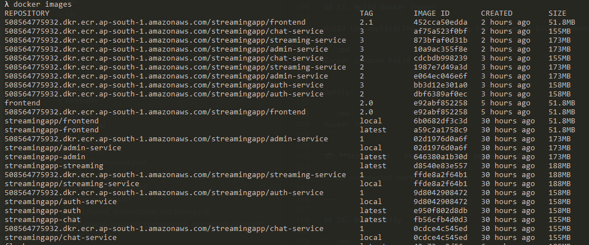

---

# PART 6 — Configure AWS ECR

## Step 33 — Set AWS Region

```powershell
$env:AWS_REGION="ap-south-1"
```

---

## Step 34 — Get AWS Account ID

```powershell
$env:AWS_ACCOUNT_ID = aws sts get-caller-identity --query Account --output text
```

Verify:

```powershell
$env:AWS_ACCOUNT_ID
```

---

## Step 35 — Set ECR Registry

```powershell
$env:ECR_REGISTRY="$env:AWS_ACCOUNT_ID.dkr.ecr.$env:AWS_REGION.amazonaws.com"
```

Verify:

```powershell
$env:ECR_REGISTRY
```

---

## Step 36 — Create Auth ECR Repository

```powershell
aws ecr create-repository `
  --repository-name streamingapp/auth-service `
  --region $env:AWS_REGION
```

---

## Step 37 — Create Streaming ECR Repository

```powershell
aws ecr create-repository `
  --repository-name streamingapp/streaming-service `
  --region $env:AWS_REGION
```

---

## Step 38 — Create Admin ECR Repository

```powershell
aws ecr create-repository `
  --repository-name streamingapp/admin-service `
  --region $env:AWS_REGION
```

---

## Step 39 — Create Chat ECR Repository

```powershell
aws ecr create-repository `
  --repository-name streamingapp/chat-service `
  --region $env:AWS_REGION
```

---

## Step 40 — Verify ECR Repositories

```powershell
aws ecr describe-repositories `
  --region $env:AWS_REGION `
  --query "repositories[].repositoryName" `
  --output table
```

Expected:

```text
streamingapp/auth-service
streamingapp/streaming-service
streamingapp/admin-service
streamingapp/chat-service
```

---

# PART 7 — Push Images to ECR

## Step 41 — Login to ECR

```powershell
aws ecr get-login-password --region $env:AWS_REGION |
docker login --username AWS --password-stdin $env:ECR_REGISTRY
```

Expected:

```text
Login Succeeded
```

---

## Step 42 — Tag Auth Image

```powershell
docker tag streamingapp/auth-service:local `
  "$env:ECR_REGISTRY/streamingapp/auth-service:1"
```

---

## Step 43 — Push Auth Image

```powershell
docker push `
  "$env:ECR_REGISTRY/streamingapp/auth-service:1"
```
---

## Step 44 — Tag Streaming Image

```powershell
docker tag streamingapp/streaming-service:local `
  "$env:ECR_REGISTRY/streamingapp/streaming-service:1"
```

---

## Step 45 — Push Streaming Image

```powershell
docker push `
  "$env:ECR_REGISTRY/streamingapp/streaming-service:1"
```

---

## Step 46 — Tag Admin Image

```powershell
docker tag streamingapp/admin-service:local `
  "$env:ECR_REGISTRY/streamingapp/admin-service:1"
```

---

## Step 47 — Push Admin Image

```powershell
docker push `
  "$env:ECR_REGISTRY/streamingapp/admin-service:1"
```

---

## Step 48 — Tag Chat Image

```powershell
docker tag streamingapp/chat-service:local `
  "$env:ECR_REGISTRY/streamingapp/chat-service:1"
```

---

## Step 49 — Push Chat Image

```powershell
docker push `
  "$env:ECR_REGISTRY/streamingapp/chat-service:1"
```

---

## Step 50 — Verify ECR Images

```powershell
$repos = @(
    "streamingapp/auth-service",
    "streamingapp/streaming-service",
    "streamingapp/admin-service",
    "streamingapp/chat-service"
)

foreach ($repo in $repos) {
    Write-Host "`n===== $repo ====="

    aws ecr describe-images `
      --repository-name $repo `
      --region $env:AWS_REGION `
      --query "imageDetails[].{Tags:imageTags,PushedAt:imagePushedAt}" `
      --output table
}
```

### Screenshot

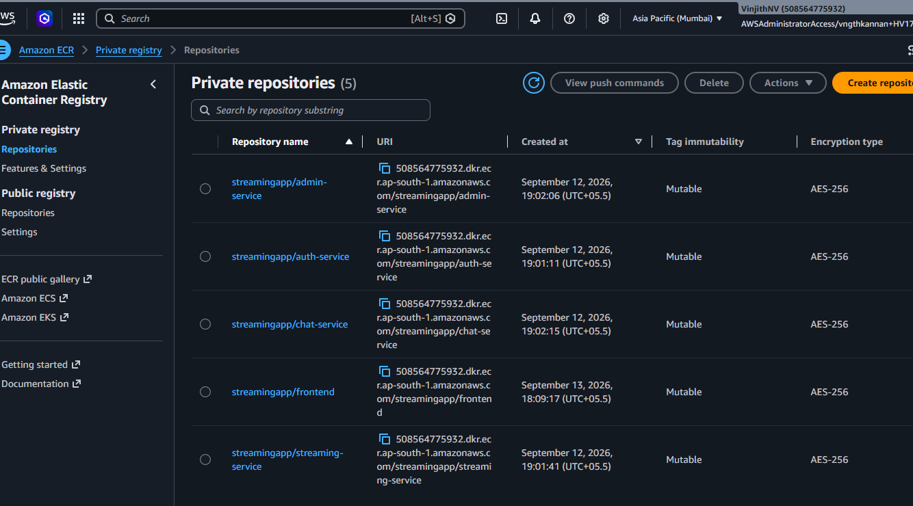

---

# PART 8 — Jenkins CI/CD

## Step 51 — Use the Shared Jenkins Environment

Jenkins is provided as a shared tool for this assignment. **A separate Jenkins EC2 instance does not need to be created, and Jenkins does not need to be installed or configured from scratch.**

Use the shared Jenkins URL and the credentials provided for the assignment.

The Jenkins environment is responsible for orchestrating the CI/CD workflow, including:

- Checking out the GitHub repository
- Building the application Docker images
- Running the required tests/validation
- Authenticating with Amazon ECR
- Pushing images to Amazon ECR
- Triggering the Kubernetes/Helm deployment workflow as configured by the project

### Screenshot

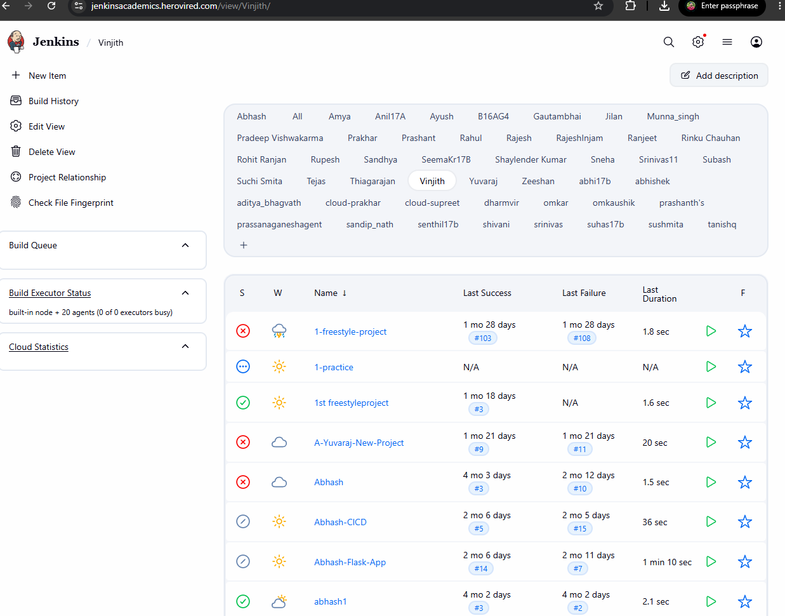

---

## Step 52 — Configure Jenkins Credentials

Use the credentials already provided/configured for the shared Jenkins environment.

Verify that the pipeline has access to the required AWS/ECR credentials and any Kubernetes/Helm deployment credentials required by the pipeline.

**Do not create a new Jenkins EC2 instance or install Jenkins.**

### Screenshot

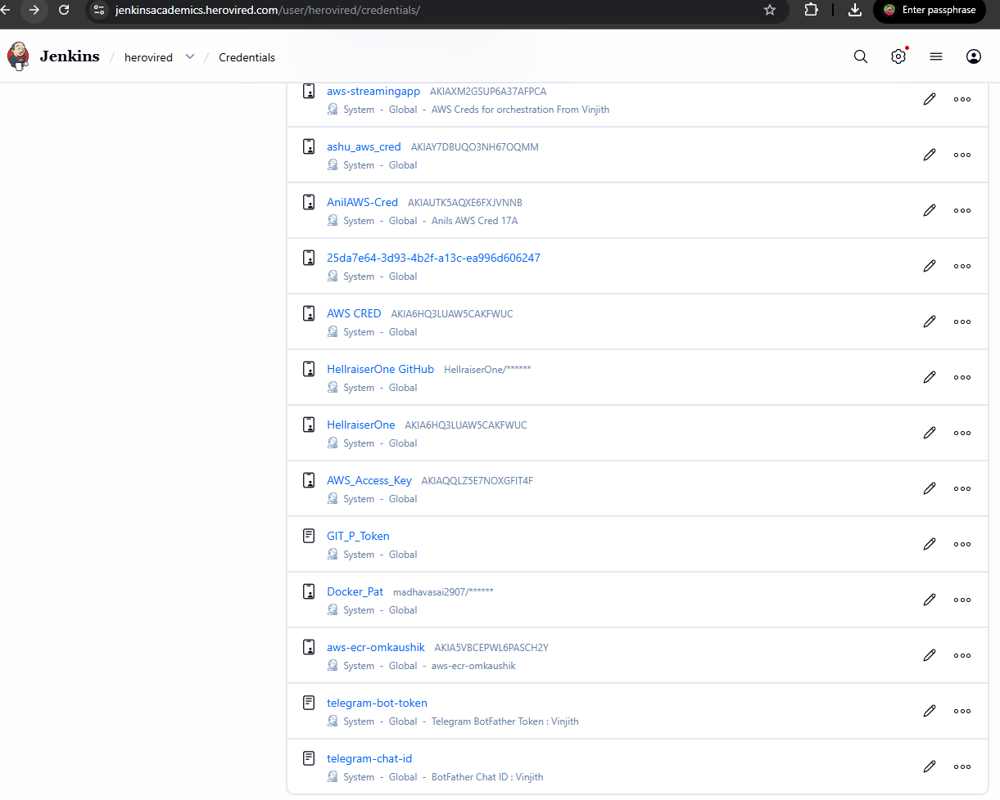

---

## Step 53 — Create/Use the Jenkins Pipeline

Use the Jenkins pipeline associated with the assignment repository:

```text
https://github.com/vinjithkannan/orchestration-assignment
```

The pipeline should orchestrate the following flow:

```text
GitHub Repository
       ↓
Jenkins Shared Environment
       ↓
Checkout
       ↓
Build / Test
       ↓
Docker Build
       ↓
ECR Login
       ↓
Push Images to ECR
       ↓
Helm / Kubernetes Deployment
       ↓
EKS
```

If the Jenkins job is already provided, use the existing job rather than creating another Jenkins server.

### Screenshot

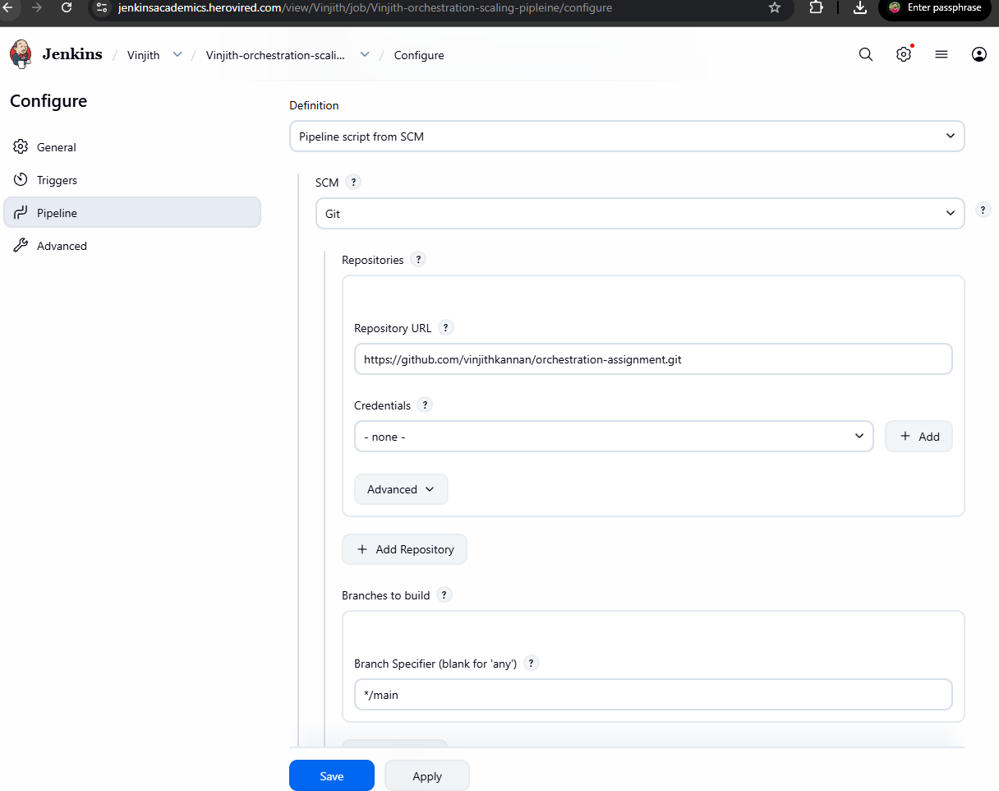

---

## Step 54 — Run Jenkins Pipeline

Trigger the Jenkins pipeline from the shared Jenkins environment.

Verify that the required stages complete successfully and that the expected Docker images are available in Amazon ECR.

If the pipeline includes Kubernetes/Helm deployment, verify that the deployment reaches the EKS cluster successfully.

### Screenshot

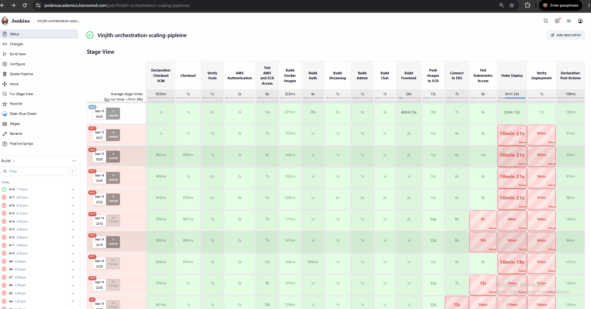

---

# PART 9 — Create EKS Cluster

## Step 57 — Verify eksctl

```powershell
eksctl version
```

---

## Step 58 — Create EKS Cluster Configuration

Create:

```text
k8s/cluster.yaml
```

Configuration:

```yaml
apiVersion: eksctl.io/v1alpha5
kind: ClusterConfig

metadata:
  name: streamingapp-eks
  region: ap-south-1

vpc:
  nat:
    gateway: Disable

managedNodeGroups:
  - name: workers
    instanceType: t3.small
    minSize: 2
    desiredCapacity: 2
    maxSize: 2
    privateNetworking: false
    volumeSize: 20
    volumeType: gp3
    volumeEncrypted: true
```

---

## Step 59 — Validate Cluster Configuration

```powershell
eksctl create cluster -f k8s/cluster.yaml --dry-run
```

The configuration should pass validation.

---

## Step 60 — Create EKS Cluster

```powershell
eksctl create cluster -f k8s/cluster.yaml
```

This creates the EKS control plane and worker nodes.

### Screenshot

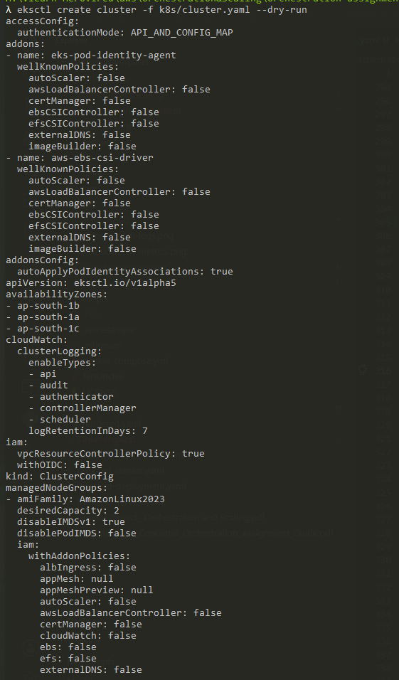

---

# PART 10 — Kubernetes Deployment

## Step 61 — Verify Kubernetes Context

```powershell
kubectl config current-context
```

---

## Step 62 — Verify Cluster

```powershell
kubectl get nodes
```

Expected:

```text
STATUS   Ready
```

### Screenshot

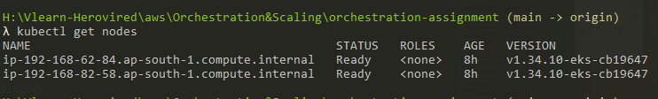

---

## Step 63 — Create Namespace

```powershell
kubectl create namespace streamingapp
```

Verify:

```powershell
kubectl get namespaces
```

---

## Step 64 — Create Kubernetes Configuration

Create the required Kubernetes configuration files:

```text
k8s/
├── namespace.yaml
├── backend-deployment.yaml
├── backend-service.yaml
├── frontend-deployment.yaml
├── frontend-service.yaml
├── mongo-deployment.yaml
├── mongo-service.yaml
├── configmap.yaml
├── secret.yaml
└── ingress.yaml
```

---

## Step 65 — Deploy MongoDB

Apply MongoDB resources:

```powershell
kubectl apply -f k8s/mongo-deployment.yaml -n streamingapp
kubectl apply -f k8s/mongo-service.yaml -n streamingapp
```

Verify:

```powershell
kubectl get pods -n streamingapp
```
---

## Step 66 — Deploy Backend Services

Deploy:

- Auth Service
- Streaming Service
- Admin Service
- Chat Service

Example:

```powershell
kubectl apply -f k8s/backend-deployment.yaml -n streamingapp
kubectl apply -f k8s/backend-service.yaml -n streamingapp
```

Verify:

```powershell
kubectl get deployments -n streamingapp
kubectl get services -n streamingapp
```

---

## Step 67 — Deploy Frontend

Apply:

```powershell
kubectl apply -f k8s/frontend-deployment.yaml -n streamingapp
kubectl apply -f k8s/frontend-service.yaml -n streamingapp
```

Verify:

```powershell
kubectl get pods -n streamingapp
kubectl get svc -n streamingapp
```

### Screenshot

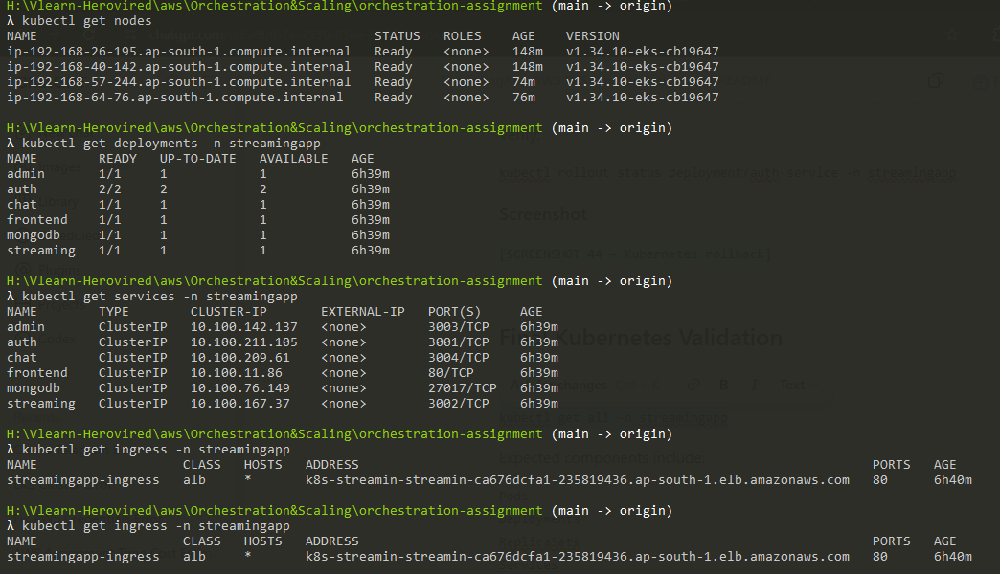
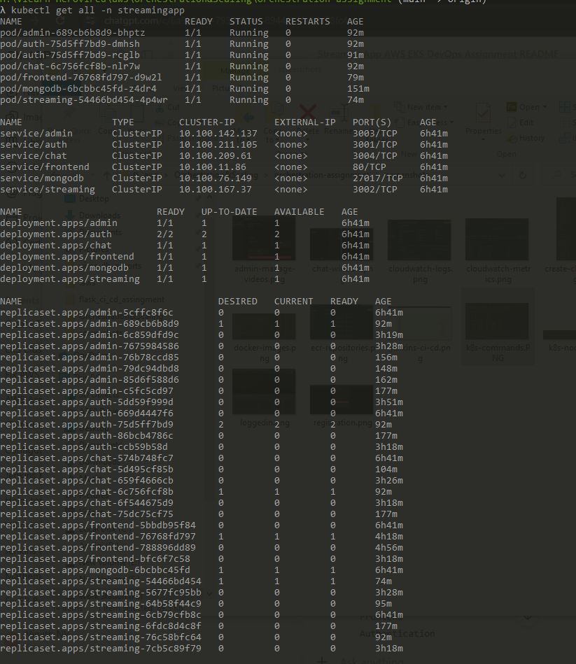

---

# PART 11 — Helm Deployment

## Step 68 — Create Helm Chart

Create the Helm chart:

```text
helm/
└── streamingapp/
    ├── Chart.yaml
    ├── values.yaml
    └── templates/
        ├── namespace.yaml
        ├── configmap.yaml
        ├── secret.yaml
        ├── mongo.yaml
        ├── auth.yaml
        ├── streaming.yaml
        ├── admin.yaml
        ├── chat.yaml
        ├── frontend.yaml
        └── ingress.yaml
```

Validate:

```powershell
helm lint helm/streamingapp
```
---

# PART 12 — Ingress and AWS Load Balancer

## Step 69 — Configure AWS Load Balancer and Application Verification

Install/configure the AWS Load Balancer Controller and deploy the Kubernetes Ingress.

The application routing should provide access to:

```text
/
    → Frontend

/api/auth
    → Auth Service

/api/streaming
    → Streaming Service

/api/admin
    → Admin Service

/api/chat
    → Chat Service

/socket.io
    → Chat Service
```

Check:

```powershell
kubectl get ingress -n streamingapp
```

Obtain the ALB address:

```powershell
kubectl get ingress -n streamingapp
```

Open the resulting ALB address in a browser.

### Screenshot

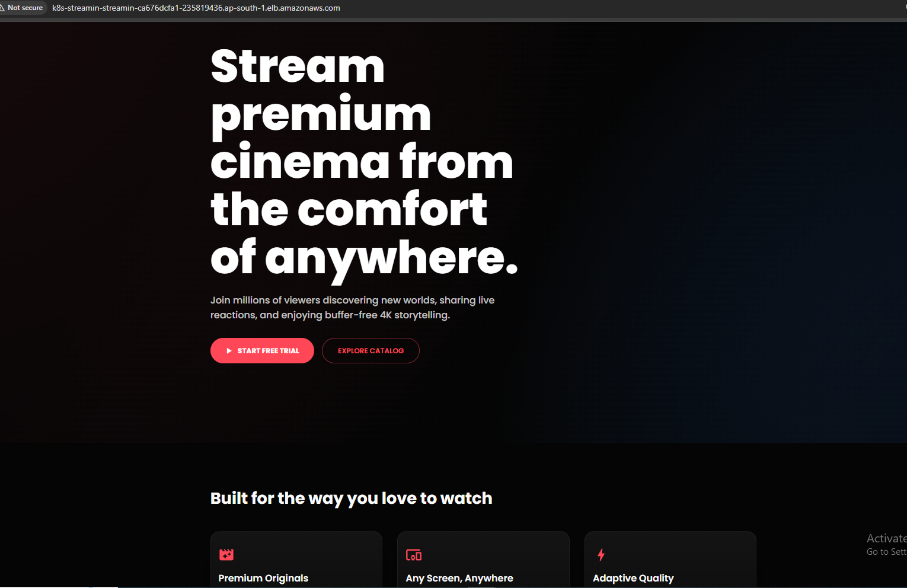

---

# PART 13 — Scaling and Rolling Updates

## Step 70 — Validate Scaling, Rolling Updates and Final Deployment

### Check all pods

```powershell
kubectl get pods -n streamingapp -o wide
```

### Check deployments

```powershell
kubectl get deployments -n streamingapp
```

### Check services

```powershell
kubectl get services -n streamingapp
```

### Scale a deployment

Example:

```powershell
kubectl scale deployment auth-service `
  --replicas=3 `
  -n streamingapp
```

Verify:

```powershell
kubectl get pods -n streamingapp
```

---

## Rolling Update

Update the container image:

```powershell
kubectl set image deployment/auth-service `
  auth-service=<ECR_IMAGE>:2 `
  -n streamingapp
```

Monitor:

```powershell
kubectl rollout status deployment/auth-service -n streamingapp
```
---

## Rollout History

```powershell
kubectl rollout history deployment/auth-service -n streamingapp
---

## Rollback

If required:

```powershell
kubectl rollout undo deployment/auth-service -n streamingapp
```

Verify:

```powershell
kubectl rollout status deployment/auth-service -n streamingapp
```
---

# Final Kubernetes Validation

Run:

```powershell
kubectl get all -n streamingapp
```

Expected components include:

```text
Pods
Deployments
ReplicaSets
Services
```

---

# Final Application Test

Verify the application through the ALB URL.

Test:

```text
Frontend
Authentication
Streaming
Administration
Chat
Socket.IO
```

### Screenshot

![Final application test]


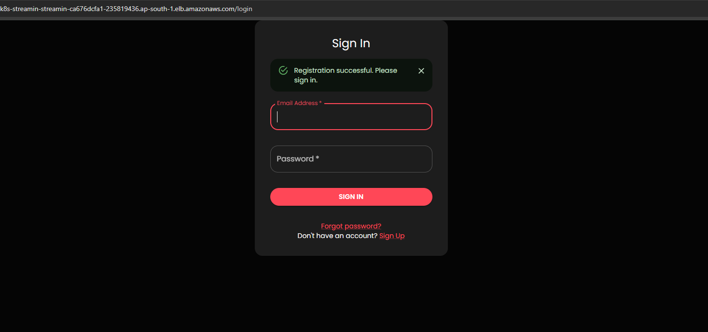

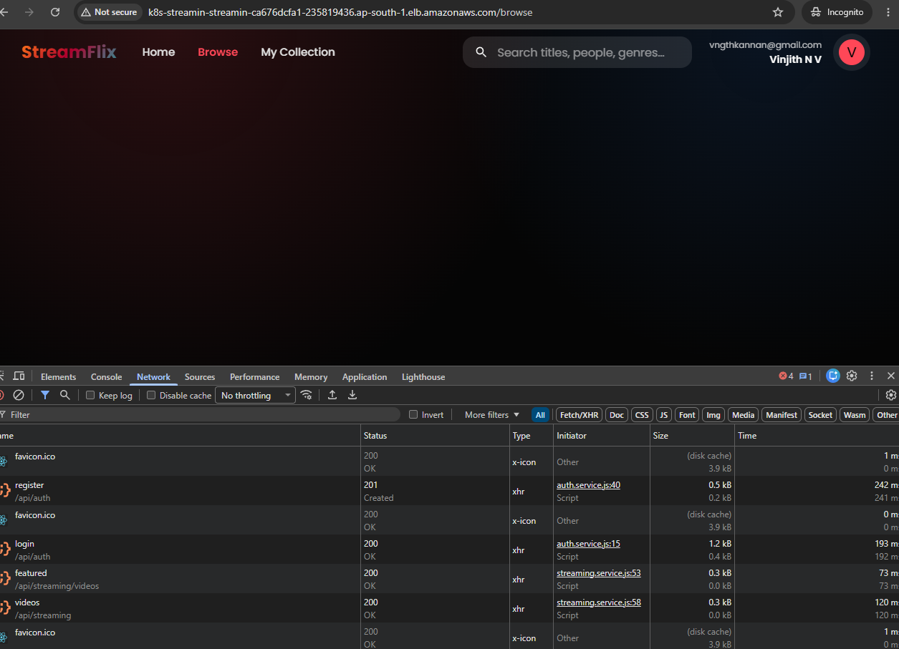

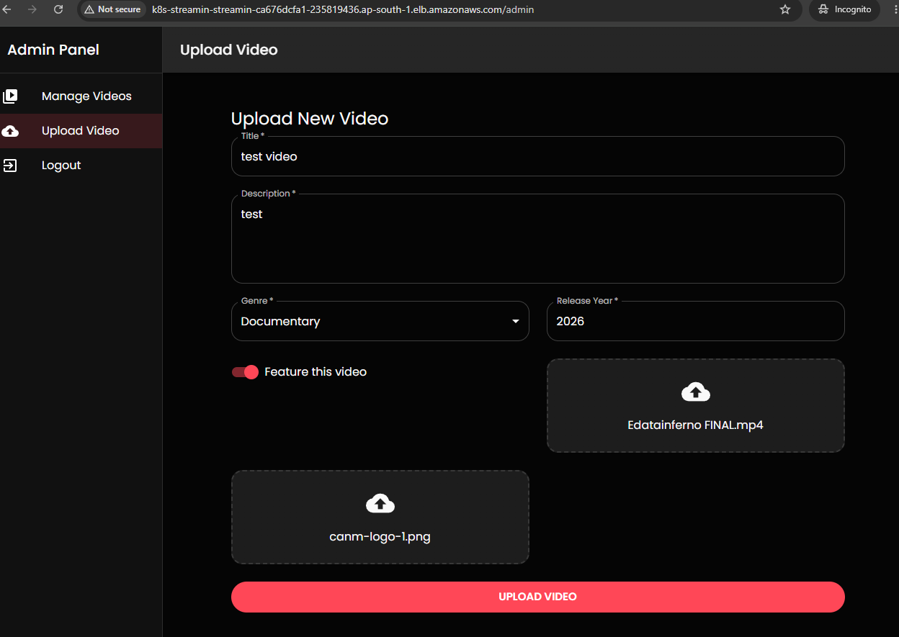

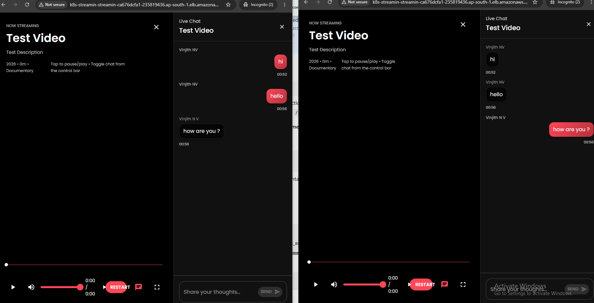

---

# Docker Images

Backend images stored in Amazon ECR:

```text
streamingapp/auth-service
streamingapp/streaming-service
streamingapp/admin-service
streamingapp/chat-service
```

Frontend image can be built and pushed after the final ALB/API URLs are known.

---

# Kubernetes Resources

The final Kubernetes environment contains:

```text
EKS Cluster
│
├── Namespace: streamingapp
│
├── MongoDB
│
├── Auth Service
│
├── Streaming Service
│
├── Admin Service
│
├── Chat Service
│
├── Frontend
│
├── Services
│
├── ConfigMaps
│
├── Secrets
│
└── Ingress
```

---

# Health Checks

| Service | Health Endpoint |
|---|---|
| Auth | `/health` |
| Streaming | `/api/health` |
| Chat | `/api/health` |

Health checks are used to verify application availability and support Kubernetes container lifecycle management.

---

# Scaling Demonstration

The project demonstrates Kubernetes scaling using:

```powershell
kubectl scale deployment <deployment-name> --replicas=<number> -n streamingapp
```

Example:

```powershell
kubectl scale deployment auth-service --replicas=3 -n streamingapp
```

Verify:

```powershell
kubectl get pods -n streamingapp
```

---

# Rolling Deployment Demonstration

The application supports rolling image updates using:

```powershell
kubectl set image deployment/<deployment> <container>=<new-image> -n streamingapp
```

Deployment progress:

```powershell
kubectl rollout status deployment/<deployment> -n streamingapp
```

---

# Useful Kubernetes Commands

## Pods

```powershell
kubectl get pods -n streamingapp
```

## Deployments

```powershell
kubectl get deployments -n streamingapp
```

## Services

```powershell
kubectl get svc -n streamingapp
```

## Ingress

```powershell
kubectl get ingress -n streamingapp
```

## Events

```powershell
kubectl get events -n streamingapp --sort-by=.lastTimestamp
```

## Pod Logs

```powershell
kubectl logs <pod-name> -n streamingapp
```

## Pod Details

```powershell
kubectl describe pod <pod-name> -n streamingapp
```

## Deployment Details

```powershell
kubectl describe deployment <deployment-name> -n streamingapp
```

---

# Helm Commands

## Lint

```powershell
helm lint helm/streamingapp
```

## Template

```powershell
helm template streamingapp helm/streamingapp
```

## Install

```powershell
helm install streamingapp helm/streamingapp `
  -n streamingapp `
  --create-namespace
```

## Upgrade

```powershell
helm upgrade streamingapp helm/streamingapp `
  -n streamingapp
```

## Status

```powershell
helm status streamingapp -n streamingapp
```

## List Releases

```powershell
helm list -n streamingapp
```

---

# Troubleshooting

## Check Pod Status

```powershell
kubectl get pods -n streamingapp
```

If a pod is not running:

```powershell
kubectl describe pod <pod-name> -n streamingapp
```

---

## Check Logs

```powershell
kubectl logs <pod-name> -n streamingapp
```

For a previous crashed container:

```powershell
kubectl logs <pod-name> -n streamingapp --previous
```

---

## Check Events

```powershell
kubectl get events -n streamingapp --sort-by=.lastTimestamp
```

---

## Check ECR Image

```powershell
aws ecr describe-images `
  --repository-name streamingapp/auth-service `
  --region ap-south-1
```

---


# PART 14 — CloudWatch Monitoring and Metrics

## Step 71 — CloudWatch Monitoring Overview

Amazon CloudWatch can be used to monitor the AWS infrastructure supporting the StreamingApp deployment.

The monitoring scope includes:

- EKS cluster and worker-node monitoring
- CPU and memory utilization
- Application and Kubernetes health indicators
- ALB request and response metrics
- CloudWatch logs where enabled
- Operational visibility during deployment and testing

For this academic demonstration, monitoring should be enabled only for the resources required for the screenshots/demo.
---

## Step 72 — Check EKS and Node Metrics

Open the AWS CloudWatch console and review the available metrics for the EKS environment and worker nodes.

Useful metrics include:

```text
CPUUtilization
NetworkIn
NetworkOut
DiskReadBytes
DiskWriteBytes
```

Review the metrics during application deployment and load/scaling demonstrations.

---

## Step 73 — Monitor Application Load Balancer Metrics

Review the Application Load Balancer metrics in CloudWatch.

Useful ALB metrics include:

```text
RequestCount
TargetResponseTime
HTTPCode_Target_2XX_Count
HTTPCode_Target_4XX_Count
HTTPCode_Target_5XX_Count
HealthyHostCount
UnHealthyHostCount
```

These metrics help demonstrate application traffic, response time and target health.

---

## Step 74 — CloudWatch Logs

Where CloudWatch logging is enabled, review the available log groups and streams.

Typical checks include:

```text
Log groups
Log streams
Recent application/platform logs
Error messages
Timestamped events
```

Use the logs together with Kubernetes commands when troubleshooting:

```powershell
kubectl get pods -n streamingapp
kubectl get events -n streamingapp --sort-by=.lastTimestamp
kubectl logs <pod-name> -n streamingapp
```

### Screenshot

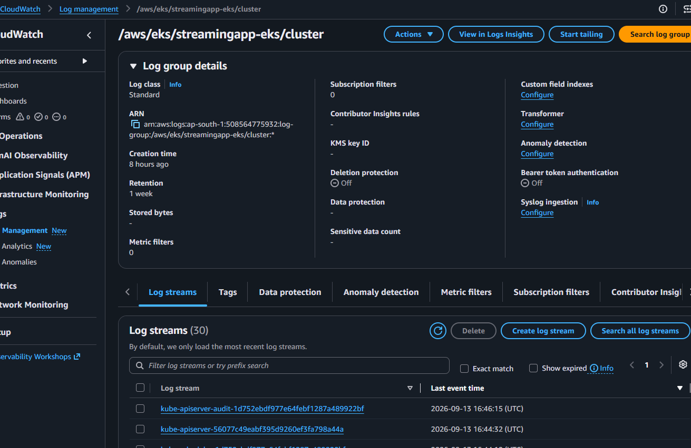

---

## Step 75 — Metrics During Scaling

Demonstrate the relationship between Kubernetes scaling and infrastructure metrics.

Example:

```powershell
kubectl scale deployment auth-service `
  --replicas=3 `
  -n streamingapp

kubectl get pods -n streamingapp
```

Then review CloudWatch metrics to observe the infrastructure during the scaling activity.

### Screenshot

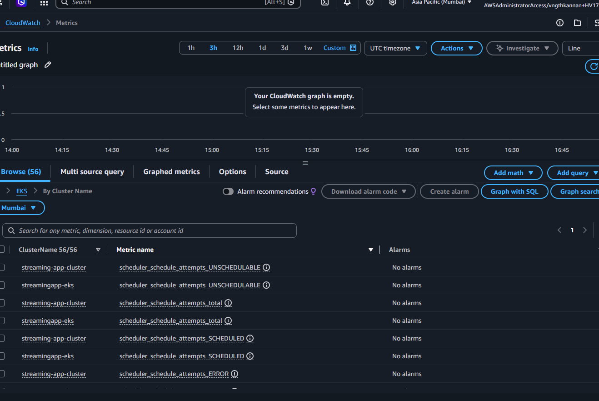

---

# BONUS — SNS ChatOps Notifications

## Bonus Step 76 — Create an SNS Topic

Amazon Simple Notification Service (SNS) can be used as a bonus integration for deployment and pipeline notifications.

Create an SNS topic:

```powershell
aws sns create-topic `
  --name streamingapp-pipeline-events `
  --region ap-south-1
```

Save the returned TopicArn.

---

## Bonus Step 77 — Subscribe to SNS Notifications

For an email notification:

```powershell
aws sns subscribe `
  --topic-arn <SNS_TOPIC_ARN> `
  --protocol email `
  --notification-endpoint <YOUR_EMAIL> `
  --region ap-south-1
```

Confirm the subscription from the email received from AWS SNS.

---

## Bonus Step 78 — Publish a Test Notification

Test the SNS topic:

```powershell
aws sns publish `
  --topic-arn <SNS_TOPIC_ARN> `
  --subject "StreamingApp Pipeline Notification" `
  --message "StreamingApp Jenkins pipeline completed successfully." `
  --region ap-south-1
```

Expected:

```text
MessageId
```

Verify that the subscribed endpoint receives the notification.

### Screenshot

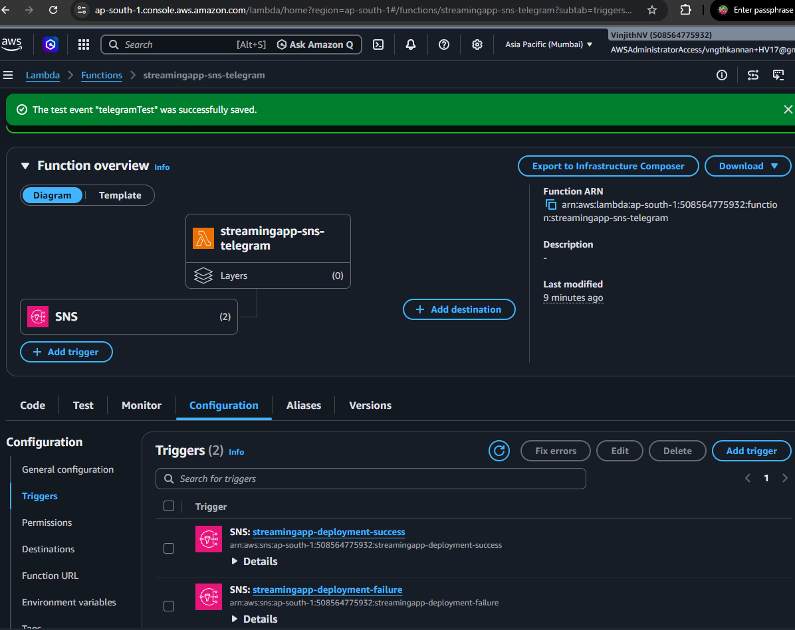

---

## Bonus Step 79 — Jenkins / ChatOps Integration

For the bonus ChatOps workflow, SNS can be connected to pipeline or deployment events.

Example flow:

```text
Jenkins
   |
   +---- Pipeline Success
   |
   +---- Pipeline Failure
   |
   v
Amazon SNS
   |
   +---- Telegram Group Notification
   |
   +---- Optional Lambda / HTTPS integration
   |
   v
Notification Channel
```

Possible events:

```text
Pipeline Success
Pipeline Failure
Deployment Success
Deployment Failure
Rollback
```

The SNS integration is **optional bonus functionality** and is not required for the core StreamingApp deployment.

### Screenshot

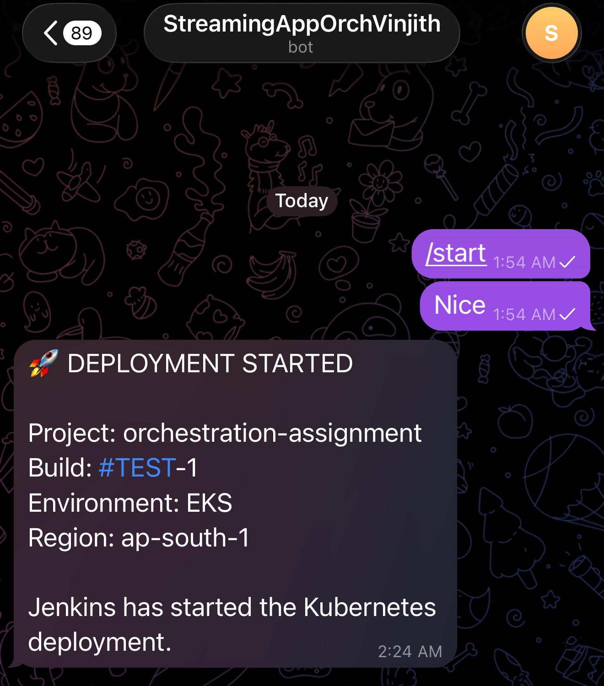

# Cost Optimization

This project is designed for demonstration and academic evaluation.

AWS resources should not be left running unnecessarily.

Recommended workflow:

```text
Create
  ↓
Deploy
  ↓
Test
  ↓
Take Screenshots
  ↓
Record Demonstration
  ↓
Delete Resources
```

Avoid leaving the following resources running continuously:

- EKS cluster
- Unnecessary Jenkins infrastructure (Jenkins is provided as a shared tool)
- Application Load Balancer
- NAT Gateway
- Unused ECR images
- Unused EBS volumes

The EKS configuration intentionally disables NAT Gateway usage:

```yaml
vpc:
  nat:
    gateway: Disable
```

---

# Conclusion

The StreamingApp project demonstrates an end-to-end container orchestration and deployment workflow using Docker, Amazon ECR, Jenkins, Kubernetes, Amazon EKS, Helm and AWS Load Balancing.

The implementation provides practical experience with:

- Microservice containerization
- Container registries
- CI/CD pipelines
- Kubernetes orchestration
- Service discovery
- Health checks
- Configuration management
- Secrets
- Load balancing
- Ingress
- Horizontal scaling
- Rolling deployments
- Rollbacks
- Cloud deployment
- DevOps automation
- CloudWatch monitoring and metrics
- SNS notification integration (bonus)

The project is implemented in the AWS Mumbai region (`ap-south-1`) with a focus on keeping infrastructure suitable for a short-lived academic demonstration.
